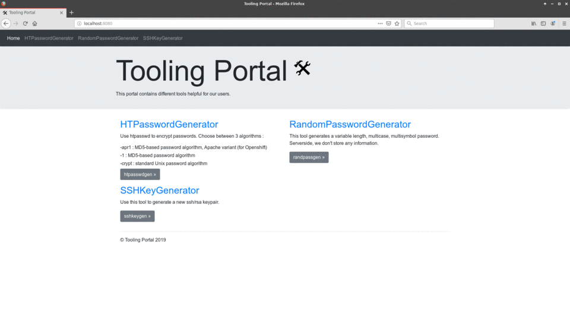

# GO TOOLING PORTAL

## What is it?



Simple and fast webapp that provides users with some self-hosted tooling to avoid insecure internet generators/processors:

- **HTPasswordGenerator**: generate htpasswords OR shadow unix standard passwords (MD5/MD-5 Apache variant OR SHA512)
- **RandomPasswordGenerator**: generate a variable length, multi-case, multi-symbol password
- **SSHKeyGenerator**: generate SSH key pairs
- **JsonPrettifier**: prettify/indent a complex Json
- **FormatConverter**: transform YAML to JSON and viceversa
- **EpochTimeConverter**: transform unix timestamp to human time and viceversa
- **Base64Converter**: encode/decode data in Base64 format
- **URLDecoder**: decode special characters in URLs

To be added in future releases:

- generate self-signed tls certificates
- generate k8s kubeconfig from service-account secret token
- transform yaml/json to golang struct

___

## General information

- Html by boostrap4 [jumbotron](https://getbootstrap.com/docs/4.0/examples/jumbotron)
- You can install it inside your organization to avoid unsafe online password generators
- Nothing is stored server-side, no database is used, everything is ephemeral
- This tool does not need internet access (all the assets are served locally)
- Works fine even if you are behind a proxy

___

## Build/prerequisites details

All the builds and tests on host machine were done using :

- Pop!_OS 22.04
- docker 25.0.3
- go version go1.22.0 linux/amd64

___

## How to run it locally without containers

- Install golang on your local vm (go >= 1.21)
  - on linux, export:
    - `echo "export GOPATH=$HOME/go" >> ~/.bashrc`
    - `echo "export GO111MODULE=on" >> ~/.bashrc`
  - create your go folders `mkdir -p ~/go/{bin,pkg,src}`
- Get the app: `cd ~/go/src/ && git clone https://github.com/sfarosu/go-tooling-portal.git`
- Build the app: `cd ~/go/src/github.com/sfarosu/go-tooling-portal && go build .`
- Run the app: `./go-tooling-portal`
- Access it in your browser at: [http://localhost:8080](http://localhost:8080)
  - metrics available at: [http://localhost:8080/metrics](http://localhost:8080/metrics)

___

## Run it inside containers

### Docker build

- Make sure you have docker and git installed on your machine
- Git clone the repo: `cd ~ && git clone https://github.com/sfarosu/go-tooling-portal.git && cd ~/go-tooling-portal && git checkout master`
- Build the image: `cd ~/go-tooling-portal && docker build -t docker.io/sfarosu/go-tooling-portal:latest -f Dockerfile .`
- Run the container daemonized : `docker run --rm -d -p 8080:8080 docker.io/sfarosu/go-tooling-portal`
- Access it in your browser at: [http://localhost:8080](http://localhost:8080)

### Docker run - use the prebuilt image from docker hub

- `docker run --rm -d -p 8080:8080 docker.io/sfarosu/go-tooling-portal:latest`
- Access it in your browser at: [http://localhost:8080](http://localhost:8080)

### Docker compose

- Run it with: `docker-compose -f deployments/docker-compose/docker-compose.yaml up`
- Stop it with: `docker-compose -f deployments/docker-compose/docker-compose.yaml down`
- Access it in your browser at: [http://localhost:8080](http://localhost:8080)

### Kubernetes

- create the deployment: `kubectl create -f deployments/kubernetes/deployment.yaml`
- create the svc: `kubectl create -f deployments/kubernetes/svc.yaml`
- create your kubernetes/ingress or openshift/route

___

## GitHub release guide

### Prerequisites tools

- make
- git
- docker
- bumpversion `sudo apt install bumpversion / brew install bumpversion`
- go
- goreleaser; install [docs](https://goreleaser.com/install/)

> **_NOTE:_** in addition, if running Debian and possibly Ubuntu derivatives, the `qemu-user-static` package needs to be installed as it's needed by docker to build against arm64 arch

### Prerequisites steps

- your GitHub personal token is exported into the `GITHUB_TOKEN` env var
- docker is started
- master branch should be selected and the repo must NOT be in dirty state

### Publish a new GitHub release

```bash
cd go-tooling-portal
git checkout master && git pull origin master
make help # list all available targets
make all # run all publishing targets
```
