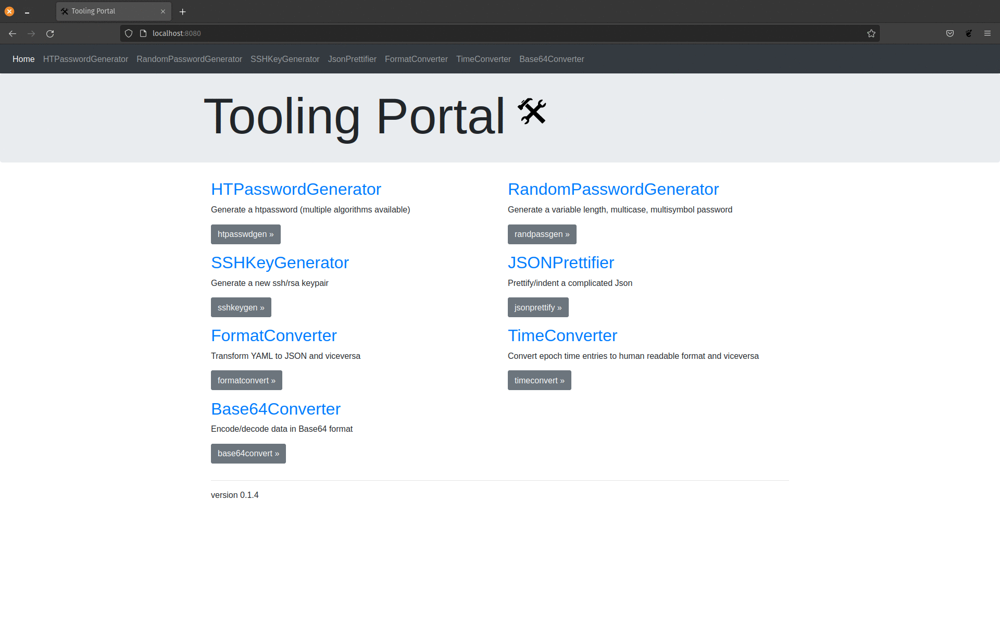

# TOOLING PORTAL

## What is it?

This portal is a simple/fast webapp that uses golang for backend and provides our users with some tooling for daily tasks:

- **HTPasswordGenerator**: this tool can generate an openshift compatible htpassword and more
- **RandomPasswordGenerator**: this tool can generate a variable length, multicase, multisymbol password
- **SSHKeyGenerator**: this tool can generate ssh/rsa keys with or without passwords

## General information

- Html by boostrap4 jumbotron: https://getbootstrap.com/docs/4.0/examples/jumbotron/ 
- You can install it inside your organization to avoid unsafe online password generators
- Nothing is stored server-side, no database is used, everything is ephemeral
- This tool does not need internet access (all the assets are served locally)
- Works fine even if you are behind a proxy

## Build/prerequisites details

All the builds and tests on host machine were done using rpm packages (no pip packages) :

- CentOS Linux release 7.6.1810 (Core)
- docker-client-1.13.1-94.gitb2f74b2.el7.centos.x86_64
- go version go1.12.4 linux/amd64

## How to run it locally without containers

- Install golang on your local vm (go >= 1.12.4)
	- on linux, export your GOPATH `echo "export GOPATH=$HOME/go" >> ~/.bashrc`
	- create your go folders `mkdir -p ~/go/{bin,pkg,src} && mkdir -p ~/go/src/github.com/sfarosu`
	- git clone the repo: `cd ~/go/src/github.com/sfarosu && git clone https://github.com/sfarosu/go-tooling-portal.git && cd go-tooling-portal && git checkout master`
- Build the app: `cd ~/go/src/github.com/sfarosu/go-tooling-portal && go build ~/go/src/github.com/sfarosu/go-tooling-portal/cmd/go-tooling-portal/`
- Run the app: `./tooling-portal`
- Access it in your browser at: [http://localhost:8080](http://localhost:8080)

## Build your docker image

- Make sure you have docker and git installed on your machine
- Git clone the repo: `cd ~ && git clone https://github.com/sfarosu/go-tooling-portal.git && cd ~/go-tooling-portal && git checkout master`
- Build the image: `cd ~/go-tooling-portal && docker build build/ -t go-tooling-portal`
- Run the container daemonized : `docker run -d -p 8080:8080 go-tooling-portal`
- Access it in your browser at: [http://localhost:8080](http://localhost:8080)

## Use the prebuilt image from docker hub

- `docker run -d -p 8080:8080 docker.io/sfarosu/go-tooling-portal`